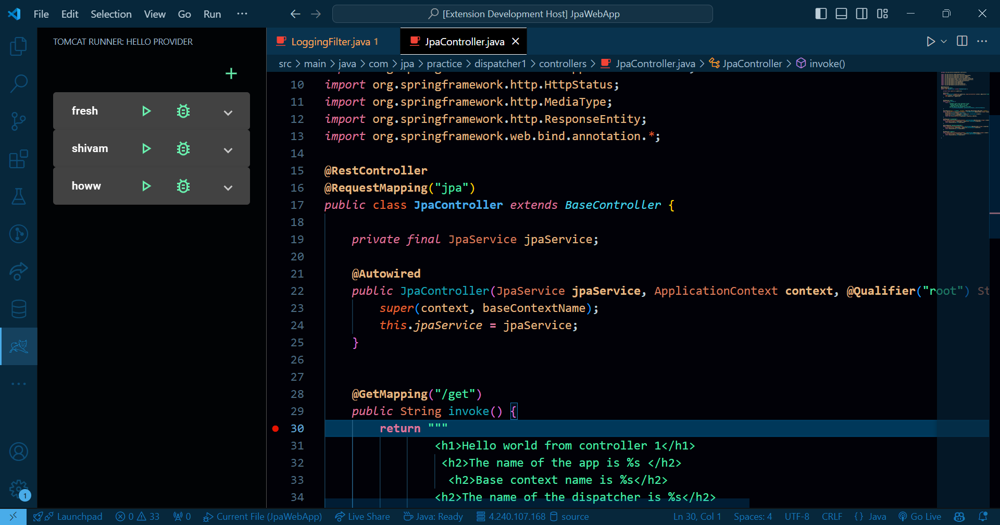
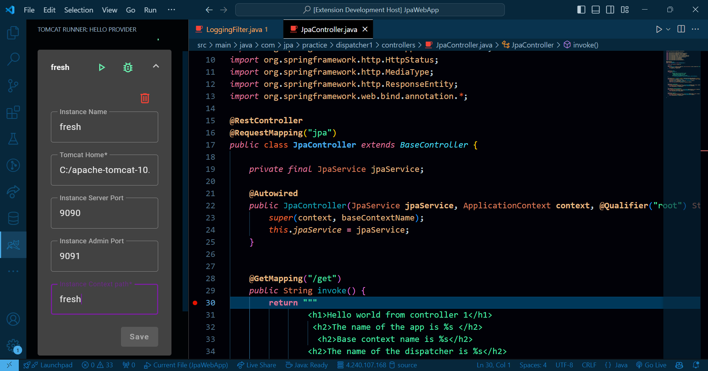
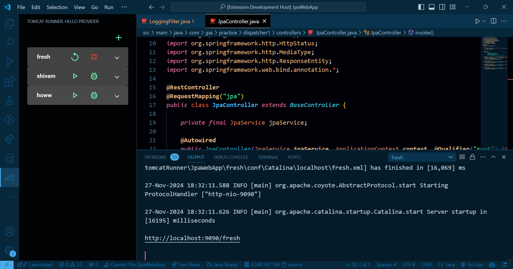
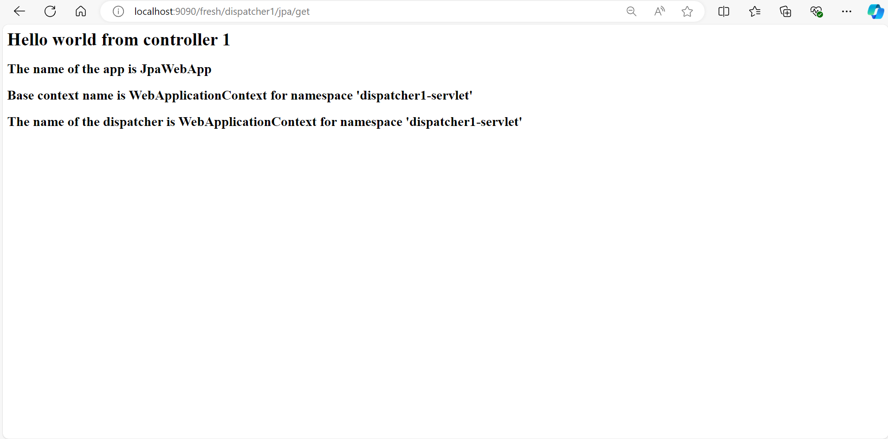
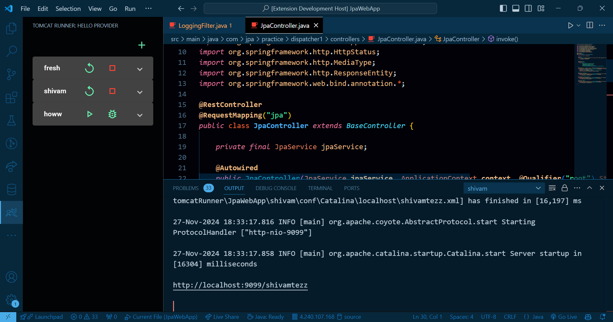
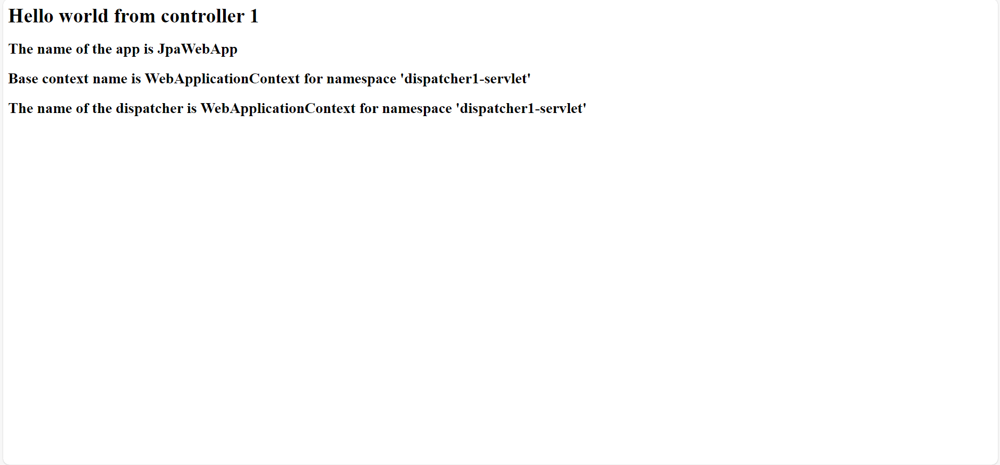
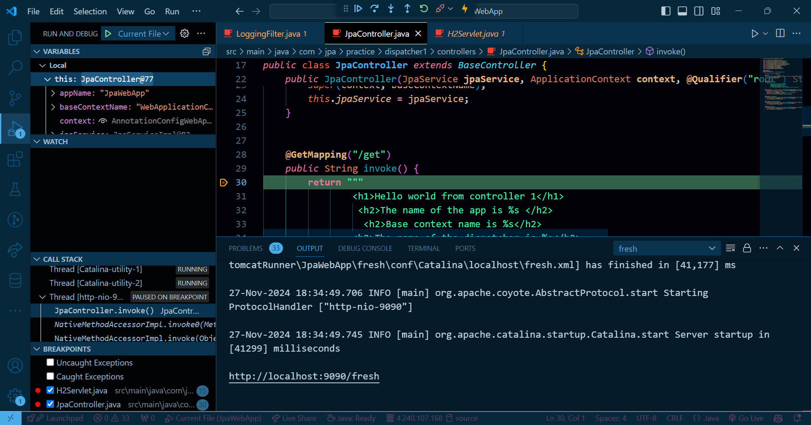

# Tomcat Runner - VS Code Extension

  
  
  

Tomcat Runner is a Visual Studio Code extension that enables users to run **Spring MVC projects** directly on a **Tomcat server** without the hassle of generating WAR files or configuring complicated setups. It also supports debugging and shows live logs for easy development and troubleshooting.

---

## 📚 Table of Contents
- [About](#about)
- [Features](#features)
- [Getting Started](#getting-started)
  - [Prerequisites](#prerequisites)
  - [Installation](#installation)
  - [Usage](#usage)
- [Technologies Used](#technologies-used)
- [Contributors](#contributors)
- [License](#license)

---

## 🧐 About
Tomcat Runner simplifies the development process for Spring MVC projects by letting developers:
- Skip the process of generating WAR files.
- Deploy and run their projects effortlessly on a Tomcat server.
- Focus more on coding and debugging with less time spent on server configurations.
- View **live logs** in **VS Code** to troubleshoot and monitor the application in real-time.
- The **UI part** of this project has been written in **Angular** for experimentation purposes.

---

## ✨ Features
- **No WAR File Generation**: Run projects without packaging them into WAR files.
- **Integrated with VS Code**: A seamless workflow directly in your favorite IDE.
- **Lightweight and Fast**: Minimal configuration required to get started.
- **Supports Spring MVC Projects**: Specifically designed for Spring MVC developers.
- **Easy Server Management**: Start, stop, or restart the Tomcat server with a single click.
- **Configurable**: Allows configuration of multiple servers with different ports and context paths.
- **Debugging Support**: Integrated debugging for easy testing and development.
- **Live Logs**: View real-time logs in VS Code for monitoring and troubleshooting.
- **UI Written in Angular**: The UI part of the project has been written in **Angular** for experimentation purposes.

---

## 🚀 Getting Started

### Prerequisites
- Visual Studio Code installed on your machine.
- **Apache Tomcat** server installed and configured on your system.
- A Spring MVC project ready to run.
- Node.js and Angular CLI installed to build the UI part.

### Installation
1. Clone the repository to your local machine.
2. Open the project in Visual Studio Code.

### Running the Extension in Developer Mode
Since the extension is **not yet available on the marketplace**, you can run it in **developer mode** after cloning the repository:

1. **Build the UI**:
   - Navigate to the `UI` directory within the project.
   - Run `ng build` to build the Angular UI.

2. **Open in Developer Mode**:
   - After building the UI, open the root project folder in VS Code.
   - Press `F5` to open the extension in **developer mode**.

### Usage
1. **Open the Tomcat Runner Extension**:
   - Once installed, open the **Tomcat Runner** extension by clicking on its icon in the Activity Bar or searching for "Tomcat Runner" in the command palette (`Ctrl+Shift+P` or `Cmd+Shift+P`).

2. **Configure Your Tomcat Server**:
   - When you open the extension, you will be prompted to **select a configuration**. There can be multiple configurations if you have more than one Tomcat server or project.
   - **Configuration Name**: Choose the configuration from the list (e.g., `Tomcat-8080`, `Tomcat-9090`).
   - **Port Number**: Specify the port on which the Tomcat server will run (e.g., `8080`).
   - **Admin Port**: Specify the admin port if required (e.g., `8005`).
   - **Context Path**: Set the context path for your project (e.g., `/myapp`).
   - **Tomcat Server Directory**: Provide the path to your **Tomcat installation directory** (e.g., `/path/to/tomcat`).

3. **Run the Project**:
   - After configuring, click **Run** to start the Tomcat server with your specified settings.
   - The project will be deployed to the specified Tomcat server and will be accessible via the browser at the configured port and context path (e.g., `http://localhost:8080/myapp`).

4. **Debugging**:
   - To debug, simply select the **Debug** option from the command palette or in the extension interface.
   - Tomcat Runner will launch the server with debugging support enabled, allowing you to set breakpoints, inspect variables, and debug your Spring MVC application directly within VS Code.

5. **View Logs**:
   - During runtime, Tomcat Runner will display **live logs** in the **VS Code Output Panel**.
   - This makes it easy to monitor the application’s performance, errors, and system messages directly within the editor.

---

## 🛠️ Technologies Used
- **Java**
- **Spring MVC**
- **Apache Tomcat**
- **Visual Studio Code APIs**
- **Angular** (UI experimentation)

---

## 👥 Contributors
- **Pranavmani Tripathi** - Developer and Maintainer  

---

## 📜 License
This project is licensed under the **MIT License**. See the [LICENSE](LICENSE) file for details.

---

## 🙌 Support
If you encounter any issues or have feature requests, feel free to open an issue in the [GitHub Repository](https://github.com/yourusername/your-repository). Contributions are welcome!

---

## 🖼️ Additional Screenshots

### Screenshot 1

### Screenshot 2

### Screenshot 3

### Screenshot 4

### Screenshot 5

### Screenshot 6

### Screenshot 7

